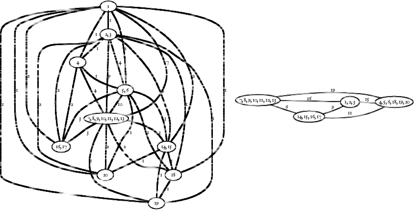

!SLIDE

# dobór U i V

<table class='lay'>
  <tr>
    <td>
      <ul>
        <li> liczba kombinacji przy <i>n</i> stanach i <i>k</i>-wejściowych komórkach FPGA</li>
        <li>algorytmy: wyczerpujący, ogólnej istotności wejść i unikalności dostarczanej informacji</li>
      </ul>
    </td>
    <td>
      

      
<i>c </i>(<i>n</i>) dla <i>k</i> = 4

    </td>
  </tr>
</table>

!SLIDE

# dobór U i V

<table class='uv'>
  <thead>
    <tr><th>automat</th><th><i>n</i></th><th>wym.</th><th colspan='7'>dostarczane</th></tr>
  </thead>
  <tbody>
    <tr><td>kirkman</td><td>12</td><td>65662</td><td>17124</td><td>17038</td><td>16345</td><td>16088</td><td>14947</td><td>14941</td><td>14941</td></tr>
    <tr><td>s208</td><td>11</td><td>9441</td><td>4474</td><td>4079</td><td>2975</td><td>1154</td><td>85</td><td>16</td><td>4</td></tr>
    <tr><td>s420</td><td>19</td><td>7605</td><td>3706</td><td>2899</td><td>1932</td><td>405</td><td>89</td><td>29</td><td>12</td></tr>
    <tr><td>s510</td><td>19</td><td>2922</td><td>16</td><td>12</td><td>9</td><td>8</td><td>4</td><td>4</td><td>4</td></tr>
    <tr><td>s820</td><td>18</td><td>25279</td><td>13016</td><td>8126</td><td>6829</td><td>3618</td><td>99</td><td>77</td><td>71</td></tr>
    <tr><td>s832</td><td>18</td><td>28339</td><td>14285</td><td>9152</td><td>6724</td><td>4886</td><td>208</td><td>110</td><td>103</td></tr>
    <tr><td>sand</td><td>11</td><td>16089</td><td>5091</td><td>1970</td><td>1956</td><td>1944</td><td>1937</td><td>503</td><td>312</td></tr>
    <tr><td>scf</td><td>27</td><td>13618</td><td>164</td><td>58</td><td>56</td><td>49</td><td>46</td><td>25</td><td>4</td></tr>
  </tbody>
</table>

## dostarczana część istotnej informacji zależy od wejścia

!SLIDE

# konstrukcja βQU

## łączenie bloków nakrycia βQ w zależności od utraty informacji (wagi krawędzi grafu)
