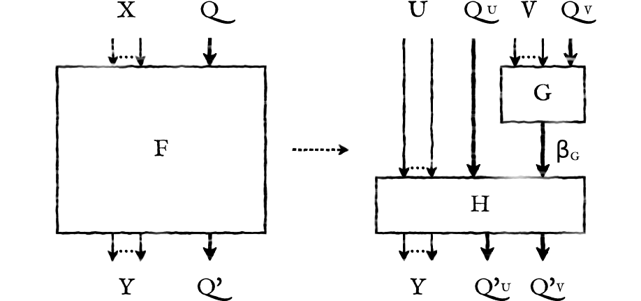

!SLIDE

##  
##  
##  
##  

# Symbolic Functional Decomposition Method for Implementation of Finite State Machines in FPGA Devices

<h2 style='font-size: 2.1em;'>Piotr Szotkowski</h2>

##  

## promotor: prof. dr hab. inż. Tadeusz Łuba

!SLIDE

# symboliczna dekompozycja funkcjonalna

!SLIDE

# częściowe kodowanie stanów

<table class='lay'>
  <tr>
    <td>
      <table class='fsm state'>
        <thead>
          <tr><th>X</th><th>Q</th><th></th><th>Q’</th><th>Y</th></tr>
        </thead>
        <tbody>
          <tr><td>–   –   0   0</td><td>init0 </td><td></td><td>init1 </td><td>0   0</td></tr>
          <tr><td>0   1   0   0</td><td>init1 </td><td></td><td>init1 </td><td>0   0</td></tr>
          <tr><td>–   –   1   –</td><td>init1 </td><td></td><td>init2 </td><td>1   0</td></tr>
          <tr><td>1   –   1   0</td><td>init2 </td><td></td><td>init4 </td><td>1   0</td></tr>
          <tr><td>–   1   1   1</td><td>init4 </td><td></td><td>init4 </td><td>1   0</td></tr>
          <tr><td>–   –   0   1</td><td>init4 </td><td></td><td>IOwait</td><td>0   1</td></tr>
          <tr><td>0   0   0   –</td><td>IOwait</td><td></td><td>IOwait</td><td>0   1</td></tr>
          <tr><td>1   0   0   –</td><td>IOwait</td><td></td><td>init1 </td><td>0   1</td></tr>
          <tr><td>0   1   1   0</td><td>IOwait</td><td></td><td>read0 </td><td>0   0</td></tr>
          <tr><td>1   1   0   0</td><td>IOwait</td><td></td><td>write0</td><td>1   1</td></tr>
          <tr><td>0   1   1   1</td><td>IOwait</td><td></td><td>RMACK </td><td>1   1</td></tr>
          <tr><td>1   1   0   1</td><td>IOwait</td><td></td><td>WMACK </td><td>0   0</td></tr>
          <tr><td>–   0   1   –</td><td>IOwait</td><td></td><td>init2 </td><td>0   1</td></tr>
          <tr><td>0   0   1   0</td><td>RMACK </td><td></td><td>RMACK </td><td>1   1</td></tr>
          <tr><td>0   1   1   1</td><td>RMACK </td><td></td><td>read0 </td><td>0   0</td></tr>
          <tr><td>1   1   0   0</td><td>WMACK </td><td></td><td>WMACK </td><td>0   0</td></tr>
          <tr><td>1   0   0   1</td><td>WMACK </td><td></td><td>write0</td><td>0   1</td></tr>
          <tr><td>0   0   0   1</td><td>read0 </td><td></td><td>read1 </td><td>1   1</td></tr>
          <tr><td>0   0   1   0</td><td>read1 </td><td></td><td>IOwait</td><td>0   1</td></tr>
          <tr><td>0   1   0   0</td><td>write0</td><td></td><td>IOwait</td><td>0   1</td></tr>
        </tbody>
      </table>
    </td>
    <td>
      <table class='fsm state encoded'>
        <thead>
          <tr><th>X</th><th>QU</th><th>QV</th><th></th><th>Q’U</th><th>Q’V</th><th>Y</th></tr>
        </thead>
        <tbody>
          <tr><td>–   –   0   0</td><td>u1</td><td>v1</td><td></td><td>u1</td><td>v2</td><td>0   0</td></tr>
          <tr><td>0   1   0   0</td><td>u1</td><td>v2</td><td></td><td>u1</td><td>v2</td><td>0   0</td></tr>
          <tr><td>–   –   1   –</td><td>u1</td><td>v2</td><td></td><td>u2</td><td>v3</td><td>1   0</td></tr>
          <tr><td>1   –   1   0</td><td>u2</td><td>v3</td><td></td><td>u2</td><td>v3</td><td>1   0</td></tr>
          <tr><td>–   1   1   1</td><td>u2</td><td>v3</td><td></td><td>u2</td><td>v3</td><td>1   0</td></tr>
          <tr><td>–   –   0   1</td><td>u2</td><td>v3</td><td></td><td>u3</td><td>v1</td><td>0   1</td></tr>
          <tr><td>0   0   0   –</td><td>u3</td><td>v1</td><td></td><td>u3</td><td>v1</td><td>0   1</td></tr>
          <tr><td>1   0   0   –</td><td>u3</td><td>v1</td><td></td><td>u1</td><td>v2</td><td>0   1</td></tr>
          <tr><td>0   1   1   0</td><td>u3</td><td>v1</td><td></td><td>u2</td><td>v2</td><td>0   0</td></tr>
          <tr><td>1   1   0   0</td><td>u3</td><td>v1</td><td></td><td>u2</td><td>v3</td><td>1   1</td></tr>
          <tr><td>0   1   1   1</td><td>u3</td><td>v1</td><td></td><td>u4</td><td>v2</td><td>1   1</td></tr>
          <tr><td>1   1   0   1</td><td>u3</td><td>v1</td><td></td><td>u4</td><td>v3</td><td>0   0</td></tr>
          <tr><td>–   0   1   –</td><td>u3</td><td>v1</td><td></td><td>u2</td><td>v3</td><td>0   1</td></tr>
          <tr><td>0   0   1   0</td><td>u4</td><td>v2</td><td></td><td>u4</td><td>v2</td><td>1   1</td></tr>
          <tr><td>0   1   1   1</td><td>u4</td><td>v2</td><td></td><td>u2</td><td>v2</td><td>0   0</td></tr>
          <tr><td>1   1   0   0</td><td>u4</td><td>v3</td><td></td><td>u4</td><td>v3</td><td>0   0</td></tr>
          <tr><td>1   0   0   1</td><td>u4</td><td>v3</td><td></td><td>u2</td><td>v3</td><td>0   1</td></tr>
          <tr><td>0   0   0   1</td><td>u2</td><td>v2</td><td></td><td>u2</td><td>v1</td><td>1   1</td></tr>
          <tr><td>0   0   1   0</td><td>u2</td><td>v1</td><td></td><td>u3</td><td>v1</td><td>0   1</td></tr>
          <tr><td>0   1   0   0</td><td>u2</td><td>v3</td><td></td><td>u3</td><td>v1</td><td>0   1</td></tr>
        </tbody>
      </table>
    </td>
  </tr>
</table>

!SLIDE

# złożoność

## **dobór U i V**
## wyczerpujący: O(2|X|)
## ogólnej istotności wejść i unikalności dostarczanej informacji: O(2|seq|)

## **konstrukcja βQU**
## <i>r</i>-przydatność: O(|βQ|2 · |βU|)
## łączenie wierzchołków grafu: O(|βQ|)2 · log2|βQ|)

## **konstrukcja βG i βQV**
## kolorowanie grafu niezgodności: O(|β|2 · |S|)
## łączenie wierzchołków grafu: O(|β|2 · |S|)
## kolorowanie równoległe: O(|βQ • βV|2 · |S| + |βQ • SV|4)
